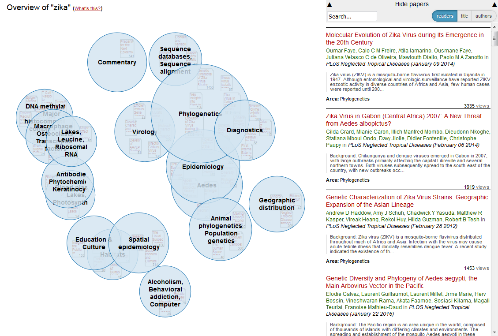

##Shuttleworth Application: Peter Kraker

*Note: each section may only be 1,500 characters long; most are still running over.*

### 1) Tell us about the world as you see it ###
We are in the midst of a revolution in scholarly communication: **the open content revolution**. More than half of scientific papers are now [published open access](http://europa.eu/rapid/press-release_IP-13-786_en.htm). With this tipping point reached and high-level mandates emerging around the world, calling for all publicly funded research to be published open access, we will likely see this number rising in the coming years. The EU is on track to reach  its goal of [60% open access publications](https://www.ffg.at/sites/default/files/downloads/page/open_access_policy.pdf) this year.  As a result, there are now more than [90 million open access papers worldwide](https://www.base-search.net/) and [more than 11.400 open access journals](https://doaj.org/). The open research data movement is following suit: in a study my colleagues and I found that the number of published datasets [has more than doubled in just 8 years](http://arxiv.org/abs/1501.03342). Source code and many other products of research are often made available, including posters, presentations, and media files. There is also more and more complementary information openly released, including metadata and metrics. Projects like the [ContentMine](http://contentmine.org) develop solutions for extracting facts from publications to further enhance metadata and provide comprehensive context for each publication and further relations between publications.

All of this open scientific content, however, can only become useful when we can discover it in a meaningful way. The major issue here is that discovery is conducted in very much the same manner as 15 years ago. Scholarly search engines are the go-to tool for most people. The problem with search engines is that they present resources in a linear, one-dimensional way, making it necessary to sift through every item in the list. They provide little context apart from basic metadata, which makes it hard to infer the topical structure of the content and relationships between resources. Most scholarly search engines are also not suited to the open science paradigm, because they typically ignore non-publication resources like presentations and datasets.

Another problem is that the individuals and communities involved in discovery (researchers, students, librarians, journalists, citizens, and educators) are currently tackling this problem on their own and for the most part in a closed manner. The results of the discovery process are usually not shared; they become visible only later as references in a publication or reading lists. Libraries do a lot of knowledge structuring, but only a small percentage of this information becomes visible on a global level, and there is usually no way for other communities to collaborate on these efforts. Therefore, the discovery process is repeated over and over again by different people, because it lacks the collaborative efficiencies that have become the norm in the open science environment. 

That is a great shame: after all, discovery has a strong social component. Researchers often get the tip for a great paper from a colleague, or when they follow a presentation at a conference. But there are many people who could benefit immensely from open content, but don’t have colleagues in research and cannot afford to go to conferences. What about students who are often introduced to new fields without sufficient overview? What about science journalists who need to make sense of research areas which they are not experts in? What about citizens who would like to learn about the newest research on an illness that affects themselves or their friends and family? And once researchers step out of their area of expertise, they usually are themselves in the very same position as everybody else.

There has been a lot of research into alternatives to search engines, but none of them have been developed into open systems for everyday use. Social media, Q&A systems and online reference management systems can only complement, but not replace a comprehensive discovery system. Another approach is to programmatically access open content using APIs and SDKs of the existing digital open science ecosystem, but this approach is only viable as long as you can code. 

**The possibilities to harvest the fruits of the digital enlightenment, as some call it, are currently unequally distributed.**

### 2) What change do you want to make in the world? 
**My goal is to bring the fruits of open content to everyone, by dramatically improving the visibility and discoverability of scientific knowledge on the web.** 

I want to enable everyone to easily get an overview of a research topic - for free and without having to be able to code or having to have an existing set of scientific resources. This includes an understanding of the underlying structure of the scientific content pertaining to a topic and the multi-dimensional relationships between different pieces of content.

I furthermore want to provide a community of support for those who do not have access to one. I want to make it possible for them to share the results of their discovery process in a structured way, so that others can add to it, provide further annotations, content and context. I want to enable them to identify others that are experts in their topic of interest or that are concerned with the same area.

In addition, I want to bring together communities that are involved in scholarly communication, dissemination, and discovery - researchers, students, citizens, journalists, librarians, and educators - and pool their collective knowledge. I want to increase the visibility and connect their local work on a global level. I believe that they will thus collaboratively create open maps of the world's scientific knowledge for the benefit of everyone.

Finally, I want to provide a welcoming, respectful and inclusive space where people can express and compare different views on the same topic to foster interdisciplinary exchange and understanding. This includes providing basic distributions of the underlying contents' side information to highlight potential biases.

### 3) What has prevented this change from happening?

Initially, this change was prevented because most of scientific information was closed, even metadata, and the only tools that gave access to this information (Web of Knowledge, Scopus) were proprietary and did not have significant competition. Their business model was to sell access to information that people could otherwise not access, and not to develop comprehensive solutions for discovery.

In addition, I believe that discovery of scholarly content has been approached mostly from a technical angle in the past. The focus has been on creating infrastructures and to solving engineering challenges. The human/social side to discovery has been neglected in my opinion, which is why there are no mainstream tools that can be used by everyone. As a result, discovery usually happens locally in a closed, non-collaborative way.

There are a number of tools that have been developed by the relational bibliometrics/knowledge domain visualization community, including [Sci2](https://sci2.cns.iu.edu/user/index.php) and [VOSViewer](http://www.vosviewer.com/), but they are mostly designed for the study of science, not discovery. They require a good amount of training and they often rely on the proprietary data sources mentioned above.

In terms of the open science movement, there were other fish to fry first, namely opening up the content in the first place. Opening scholarly content and data is an on-going effort of open science activists all around the globe, including myself. At the same time, a vast digital open science ecosystem of APIs and SDKs has been developed to access this content programmatically.

**I believe that now is the time to leverage this digital science ecosystem to create collaborative systems for the discovery of scientific content that are truly open.**

### 4) What are you going to do to get there?

My Shuttleworth Fellowship has two main foci: a technical one and a social one. 

On the technical side, I want to further develop the open source web-based visualization [Head Start](http://github.com/pkraker/Headstart), which provides interactive maps of knowledge domains. The maps are created automatically using algorithms based on content and metadata to calculate similarities among research content and to derive topical structures. The map visualization reveals relationships between content that are typically hidden. I have initiated Head Start five years ago; with my collaborators, a group of software developers, information visualization specialists, web designers, usability engineers and domain experts, I will develop Head Start into living and crowd-sourced guides to research fields.

Users will be able to explore, edit and share the maps from a single intuitive interface. They can modify and annotate the maps through [Hypothes.is](http://hypothes.is) and introduce new papers and topical areas. From there, maps are shared on [Open Knowledge Maps](http://openknowledgemaps.org) where they can be extended by other researchers – collaboratively creating layered maps of research fields. The edit history of a map will be preserved to allow Wikipedia style collaboration. The maps themselves will be open, so users can embed them on their own websites or in open lab books, and export the structure in various open formats into other tools (e.g. [Zotero](http://zotero.org), [Open Science Framework](http://osf.io)). On the backend, we will extend the existing software to incoporate a large number of open content sources, including non-publication content using [rOpenSci](http://ropensci.org) and the [Internet Archive Lab](https://github.com/ArchiveLabs/scholar.archivelab.org). In addition, we will utilize software from the [ContentMine](http://contentmine.org) and services from [OpenAIRE](http://openaire.eu) to further annotate/enrich publications with additional side information. These extensions have also been proposed in [a separate application](http://github.com/pkraker/open-discovery) for the Open Science Prize.

Technology is a necessary ingredient, but community is key to the change that I am aspiring. Therefore, I want to create a welcoming, respectful, and inclusive space where people feel that they can contribute, even if they can only add little bits, and where their contribution is adequately recognized. I think it is also very important to create something that is fun to use, with a low barrier of entrance. To achieve this, I want to use interaction metaphors that are derived from software and devices that people use every day, like wikis, social networks and smartphones.

Another important activity for me will be to create a community strategy. In order to bring people from different backgrounds together, it will be necessary to complement the online tool with offline activities. A first concrete idea is to have "mapping parties" in the spirit of [the parties of the same name in the Open Street Maps project](http://wiki.openstreetmap.org/wiki/Mapping_parties). But instead of getting together and collectively mapping a previously unrepresented neighbourhood, I envision people getting together and collectively mapping an unrepresented knowledge field. There could be many forms to this; one would be that a group of citizens with a certain interest in a research field (e.g. a rare disease) meet up with researchers and medical librarians to collectively map this field for the benefit of others affected by the disease. Another could be a group of students and journalists working on the same topic who want to pool their energy and do their discovery collectively instead of separately, benefiting others studying the same field of research.

I am also going to create an advisor program for the growing set of people who are interested in the project and want to see it being made. Advisors will contribute to the project with feedback and ideas, and by spreading the word in their local communities. Through hackdays and community gatherings such as Mozfest and OKFest, I want to grow the existing community of developers further.

**My goal in the long run is to establish a non-profit organisation whose mission is to bring open discovery to the world and to map the world's scientific knowledge in a meaningful way.** 

### 5) What challenges or uncertainties do you expect to face?

Creating an inclusive system that people from different backgrounds and disciplines will actually want to use is a big challenge. As an interdisciplinary researcher myself, my approach has always been to design systems from the users' point of view, taking usability and cognitive issues into careful consideration, and to involve users at every stage of the process (human-centered design). This approach has resulted in so much positive feedback for the existing system that it gave me the incentive and the courage to try and take the idea from a prototypical set of tools to a large-scale system. In my fellowship, I also want to review social factors that might prevent people from using open knowledge systems and participating in open knowledge events, thus creating systemic bias, and explore ways to address these issues.

Bringing the different people and communities together will certainly be a challenge. I intend  to face this challenge by expanding on knowledge that I have gained as one of the founders and main organizers of [Barcamp Graz](http://barcamp-graz.at), and as a community coordinator of the [open science working group of Open Knowledge Austria](http://okfn.at/open-science); in both cases, we have established strong local communities. I also want to study best practices and lessons learned of widely successful community projects such as [Wikipedia](http://wikipedia.org) and [Open Knowledge](http://okfn.org).

I have worked in software engineering for quite some time (15 years, thereof 7 years also as a project manager at [Know-Center](http://know-center.at)), and I therefore understand that there are a number of technical challenges that are connected to building a global system that can scale to a large number of people and maps. I am confident that I have now assembled a great initial developer community to take on these issues. I plan to use a distributed agile process and will look to other open source projects to implement a best practice development process. 

In the long run, building a self-sustainable non-profit organization will be a big challenge. I have been involved with non-profit organizations in the area of open knowledge for over 7 years in different positions - running a smaller organization, [Knowledge Management Forum Graz](http://wm-forum.org), for 2 years - and I  understand the issues that are connected to that. My main concern in the beginning will be to establish a stable funding stream.

**I am willing to take on these challenges - this is something that I want to pour my heart into not only for now, but for the foreseeable future.**

###6) What part does openness play in your idea?

**Openness is at the very core of my idea.** 

The project strives to be a building block of the digital open science ecosystem, by collaborating with existing open initiatives and building on top of their work, and openly contributing data, source code, and content that is being created back into the ecosystem.

The code will be made available on Github under the license of the existing project (LGPL v3). The visualizations will be released under CC BY 4.0 - with the exception of the contained content, which of course retains its original license. The underlying knowledge structures can be exported in various open formats under CC0, so that they can be used in other open science tools such as Zotero and the Open Science Framework.

We will actively involve the community and seek feedback, input, and pointers for collaboration throughout the project. To achieve this, the project progress is openly shared with the world, starting with this proposal which is [hosted on Github](http://github.com/pkraker/shuttleworth-application). The development will also take place on Github. The concrete targets for developing the system will be published as issues in our repositories.

Openness will also play an important role in all social activities, who will be organized in the spirit of barcamps. Mapping parties, for example, will be free of charge and there will be no restriction for attendees, other than restrictions that pertain to a specific venue (i.e. the number of people that can attend will be determined by the venue’s capacity).
