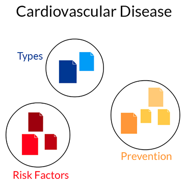
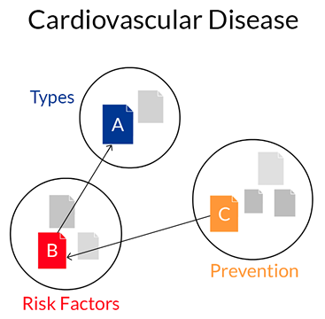
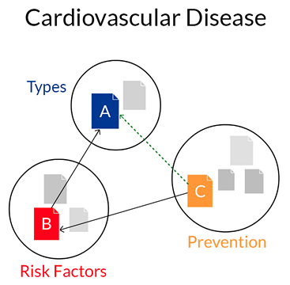

##Open Knowledge Maps: The Knowledge Seeker’s Guide to Literature

*Peter Kraker*

**Abstract:** Our exploration and discovery systems for scientific knowledge are seriously lacking. In the worst case, this may mean that citizens don’t find out about a lifesaving treatment in time. I am set to change that with knowledge maps that reveal the topical structure of a scientific field and highlight the connections between different pieces of content. Building on an existing set of tools that I/we have been developing in the past five years, I want to provide a large-scale, web-based system of open, interactive and interlinked knowledge maps spanning all fields of research. Around these maps, I want to design an inclusive and sustainable space for collective knowledge discovery that brings together the communities involved in this activity. I want to unleash their collective intelligence by enabling them to jointly annotate and modify the automatically created maps - achieving layered overviews of the world’s scientific knowledge including the perspectives of different epistemic cultures, geographic regions and so forth.

#### 1) Tell us about the world as you see it 
*A description of the status quo and context in which you will be working*

**Currently, the fruits of the open content revolution are unequally distributed.** We are in the process of [opening up massive amounts of scientific content](http://poeticeconomics.blogspot.co.at/2015/12/dramatic-growth-of-open-access-december.html), but our exploration and discovery systems are seriously lacking. What we have is an index of scientific content (Google) and a glossary (Wikipedia). More powerful tools that map the topical structure of a scientific field and highlight the connections between different pieces of content are hugely expensive. To build a mental model of a field consisting of tens of thousands, if not millions of articles, most people have to examine articles and their relationships by hand.

This is an issue for researchers, who spend a lot of time and effort on gaining and keeping an overview of scientific fields. But researchers have a community of peers that supports them in this task. People outside the scientific system, however - students, who would like to make sense of a new study subject, or citizens who would like to learn about the newest research on an illness - are usually without a network of peers and therefore often lost. This may mean that they can’t find information for the paper that they need to write; in the worst case, this may mean that they don’t find out about a lifesaving treatment in time.

There is a huge demand for better exploration and discovery tools, inside and outside of academia, but there are no large-scale attempts to provide these tools this in an open manner. I am set to change that.

#### 2) What change do you want to make in the world?
*A description of what you want to change about the status quo, in the world, your personal vision for this area*

**To bring the fruits of open content to everyone, by dramatically improving the visibility and discoverability of scientific knowledge on the web.** I want to provide a large-scale, web-based system of open, interactive and interlinked knowledge maps spanning all fields of research. The maps are automatically created based on the global research output. I want to unleash the collective intelligence of individuals and communities involved in exploration and discovery, by enabling them to collaboratively annotate and modify the automatically created maps. I also want to enable users to create and contribute their own maps - achieving layered overviews of the world’s scientific knowledge including the perspectives of different epistemic cultures, geographic regions etc.

Knowledge maps are a powerful tool for the exploration of a research field. They show the main areas of the field at a glance, and resources related to each area - see the basic example map below.

By overlaying further connections between papers, e.g. references, we can see that a certain type of cardiovascular disease (A) is caused by a risk factor (B). We can also see that a certain drug (C) moderates this risk factor. While the connection between A and B and B and C is known, the connection between A and C may be unknown, because the discoveries were made in different communities - but the link can be easily inferred from the relationships shown on the map. Maps thus enable the discovery of new knowledge.

 

#### 3) What has prevented this change from happening? 

*Describe the innovations or questions you would like to explore during the fellowship year*

**I want to explore how to best use open content to create knowledge maps on a massive scale and how to design an inclusive and sustainable space for collective knowledge mapping that brings together the communities involved in exploration and discovery.** 

Over the past few years, open access has dramatically grown with up to 50% of new articles being published open access. Even the situation regarding legacy content is changing, with the ContentMine liberating millions of facts from closed sources. I/We have built an open source, web-based knowledge mapping software called [Head Start](https://github.com/pkraker/Headstart), which is capable of producing overviews based on this content and metadata [that are deemed intuitive and useful by domain experts](http://arxiv.org/abs/1412.6462). The approach has received a lot of [positive](http://www.storybench.org/science-search-engine-visualizing-discovery-process/) [feedback](http://blogs.lse.ac.uk/impactofsocialsciences/2015/02/16/crowd-sourced-overview-visualizations-of-knowledge-domains/) and [multiple awards](http://www.know-center.tugraz.at/en/second-award-for-dissertation-of-peter-kraker/). I believe that now is the time to leverage the open content revolution to create comprehensive open tools for exploration and discovery .

Individuals and communities involved in exploration and discovery (researchers, students, librarians, journalists, citizens, and educators) are currently tackling this problem on their own. The results of their efforts are usually not shared; they become visible only later as references in a publication or as reading lists. I have assembled an initial group of enthusiasts, with which I want to explore how to bring these individuals and communities together and how a space for collective knowledge mapping needs to be designed for different communities.

#### 4) What are you going to do to get there? 

*A description of what you actually plan to do during the year*

**Further developing the existing mapping software.** Together with my collaborators, a group of software developers, designers, usability engineers and learning experts, I have sketched out [a plan on how to develop Head Start into a system of living, crowd-sourced knowledge maps](https://github.com/pkraker/open-discovery/blob/master/proposal.md). The maps will be made available on openknowledgemaps.org where they can be interactively explored, collaboratively annotated through Hypothes.is and modified in a Wikipedia-style editing process.

**Employing a human-centered design process.** My approach has always been to involve users at every step of the process, taking usability and cognitive issues into careful consideration. To create a respectful and inclusive space, I will review social factors that prevent people from using open knowledge systems, and explore ways to address these issues. I will also talk to successful community projects to find out about best practices and lessons learned.

**Creating and implementing a community strategy that involves both online and offline activities.** The first concrete ideas are to establish an advisor program as well as mapping parties in the spirit of the parties of the same name in the Open Street Maps project. But instead of getting together and collectively mapping a previously unrepresented neighbourhood, I envision people getting together and collectively mapping an underrepresented research field.

**Designing a long term strategy, addressing issues such as a legal entity and a sustainable funding stream.**
 

#### 5) What challenges or uncertainties do you expect to face?

**If we build it, will they come?** This is a challenge for any socio-technical system, which I will address by following best practices as detailed above: human-centered design and the development of a community strategy. The cold start problem will not be an issue as a massive amount of maps will be pre-computed and ready for exploration. 

**Establishing a strong and diverse community.** I intend to face this challenge by expanding on knowledge that I have gained as one of the founders of Barcamp Graz, and as a coordinator of the open science WG of Open Knowledge Austria; in both cases, we have established strong communities. I will also study best practices and lessons learned of widely successful projects such as Open Street Maps.

**Technical challenges connected to building a large-scale system.** In this respect, I will draw on my long experience in software engineering (15 years, thereof 7 years as a project manager). I am confident that I have now assembled a great initial developer community. I plan to use a distributed agile process and will look to other open source projects to implement a best practice development process.

**Launching a self-sustainable non-profit organization.** I have been involved with non-profit organizations for over 7 years in different positions - running a smaller organization, Knowledge Management Forum Graz, for 2 years - and I understand the issues that are connected to that. I also plan to gather advice from the Shuttleworth community on these issues.

#### 6) What part does openness play in your idea?

**Openness is at the very core of my idea.** Open Knowledge Maps strives to be a building block of the digital open science ecosystem, by collaborating with existing initiatives, building on top of their work, and contributing data, source code, and content that is being created back into the ecosystem. Open Knowledge Maps will also increase the visibility of and awareness for open content as open access papers can be directly read within the same interface.

The code will be made available on Github under the license of the existing project (LGPL v3). The visualizations will be released under CC BY 4.0 - with the exception of the contained content, which of course retains its original license. The underlying knowledge structures will be mapped to Wikidata concepts and can be exported in various open formats under CC0, so that they can be used in other tools, e.g. Zotero.

We will actively involve our stakeholders and seek feedback, input, and pointers for collaboration throughout the project. To achieve this, the project progress is openly shared with the world, starting with this proposal which is hosted on Github. The development will also take place on Github. The concrete targets for developing the system will be published as issues in our repositories.

Openness will also play an important role in all social activities, which will be organized in the spirit of open knowledge events. Mapping parties, for example, will be free of charge and there will be no restriction for attendees, other than restrictions that pertain to a specific venue (i.e. the number of people that can attend will be determined by the venue’s capacity).